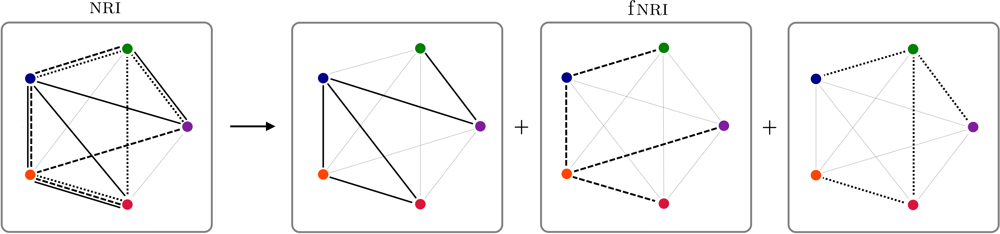

# Factorised Neural Relational Inference for Multi-Interaction Systems

This repository contains the official PyTorch implementation of:

**Factorised Neural Relational Inference for Multi-Interaction Systems.**  
Ezra Webb, Ben Day, Helena Andres-Terre, Pietro Lió 
https://arxiv.org/abs/1905.08721 



**Abstract:** Many complex natural and cultural phenomena are well modelled by systems of simple interactions between particles. A number of architectures have been developed to articulate this kind of structure, both implicitly and explicitly. We consider an unsupervised explicit model, the NRI model, and make a series of representational adaptations and physically motivated changes. Most notably we factorise the inferred latent interaction graph into a multiplex graph, allowing each layer to encode for a different interaction-type. This fNRI model is smaller in size and significantly outperforms the original in both edge and trajectory prediction, establishing a new state-of-the-art. We also present a simplified variant of our model, which demonstrates the NRI's formulation as a variational auto-encoder is not necessary for good performance, and make an adaptation to the NRI's training routine, significantly improving its ability to model complex physical dynamical systems.

Much of the code here is based on https://github.com/ethanfetaya/NRI (MIT licence). We would like to thank Thomas Kipf, Ethan Fetaya, Kuan-Chieh Wang, Max Welling & Richard Zemel for making the codebase for the Neural Relational Inference model (arXiv:1802.04687) publicly available.


### Requirements
* Pytorch 1.0
* Python 3.6

### Data generation

To replicate the experiments on simulated physical data, first generate training, validation and test data by running:

```
cd data
python generate_dataset.py
```
This generates the ideal springs and charges (I+C) dataset. Add the argument `--sim-type springchargefspring` to the command above to generate the ideal spring, charges and finite springs dataset.

### Run experiments

From the project's root folder, run
```
python train.py
```
to train an fNRI model on the I+C dataset. To run the standard NRI model, add the `--NRI` argument. You can specify a different dataset by modifying the `sim-folder` argument: `--sim-folder springchargefspring_5` will run the model on the I+C+F particle simulation with 5 particles (if it has been generated). The number of edge types in each layer graph is specified using the `--edge-types-list` argument: for the I+C+F dataset, use `--edge-types-list 2 2 2`.

To train an sfNRI model, run
```
python train_sigmoid.py
```
Here the K parameter (in this case equivalent to the number of layer-graphs) is specifed using the `--num-factors` argument: for the I+C+F dataset, use `--num-factors 3`.

To train the fNRI encoder in isolation in order to replicate the (supervised) experiments, run
```
python train_enc.py
```

To train the fNRI decoder in isolation in order to replicate the (true graph) experiments, run
```
python train_dec.py
```
The arguments `--NRI` or `--sigmoid` can be added to train the NRI and sfNRI models respectively in both of these scripts. A number of other training options are documented in the respective training files.
